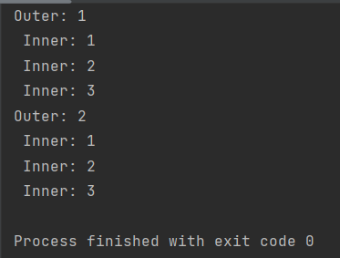

# Java For Loop
- When you know exactly how many times you want to loop through a block of code, use the for loop instead of a while loop:

#### Syntax
```java
for (statement 1; statement 2; statement 3) {
// code block to be executed
}
```

- Statement 1 is executed (one time) before the execution of the code block.

- Statement 2 defines the condition for executing the code block.

- Statement 3 is executed (every time) after the code block has been executed.

The example below will print the numbers 0 to 4:

#### Example
```java
for (int i = 0; i < 5; i++) {
System.out.println(i);
}
```

#### Example explained
- Statement 1 sets a variable before the loop starts (int i = 0).

- Statement 2 defines the condition for the loop to run (i must be less than 5). If the condition is true, the loop will start over again, if it is false, the loop will end.

- Statement 3 increases a value (i++) each time the code block in the loop has been executed.

#### Another Example

- This example will only print even values between 0 and 10:

````java
for (int i = 0; i <= 10; i = i + 2) {
System.out.println(i);
}
````
## Nested Loops

- It is also possible to place a loop inside another loop. This is called a nested loop.

The `"inner loop"` will be executed one time for each iteration of the `"outer loop"`:

#### Example
```java
// Outer loop
for (int i = 1; i <= 2; i++) {
System.out.println("Outer: " + i); // Executes 2 times

// Inner loop
for (int j = 1; j <= 3; j++) {
System.out.println(" Inner: " + j); // Executes 6 times (2 * 3)
}
}
```
 For context
 
